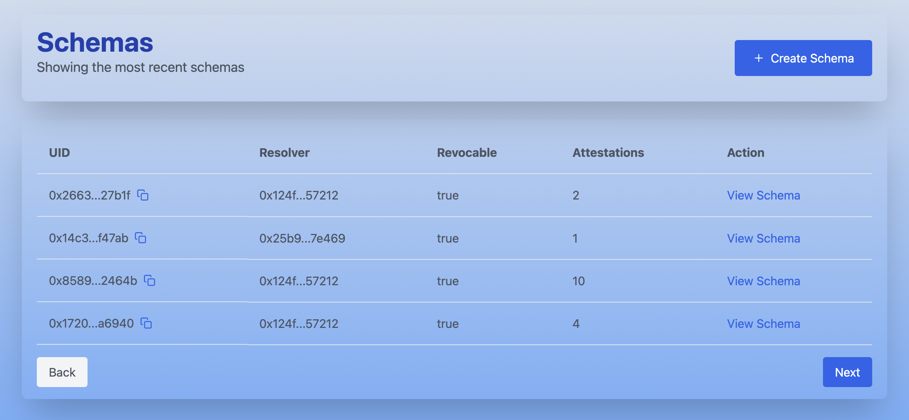
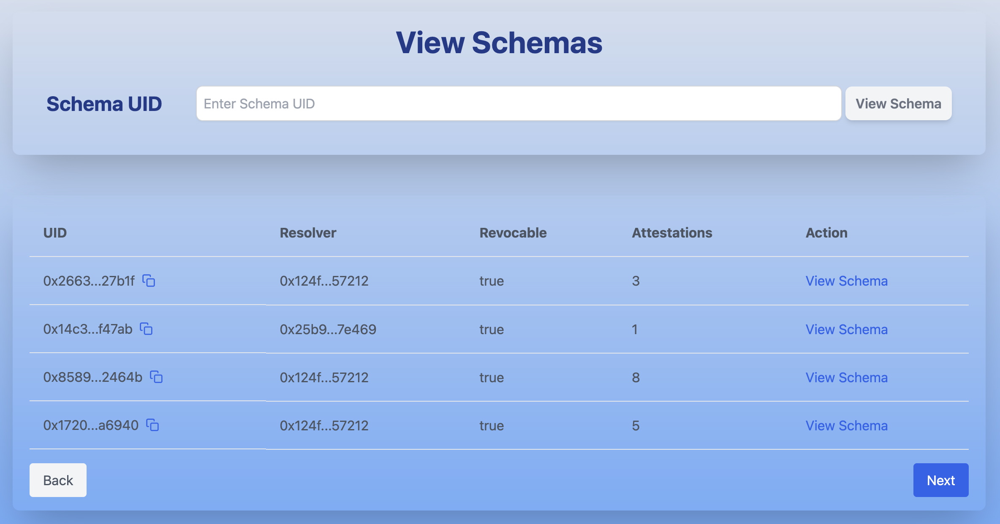
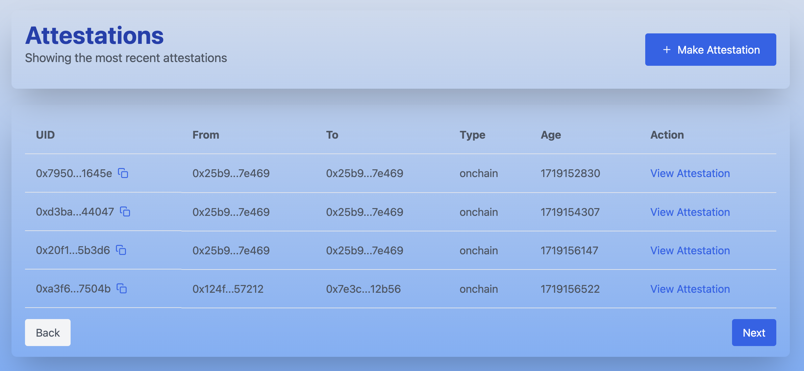
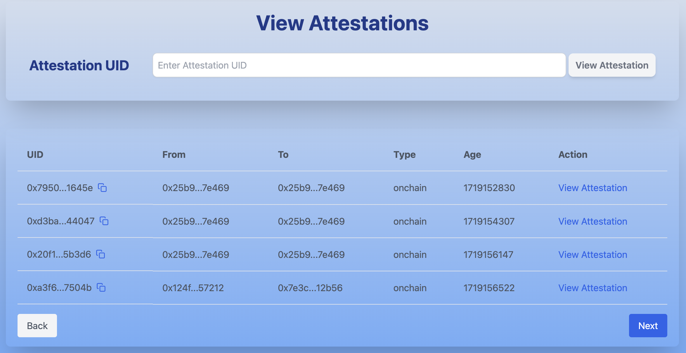

# AttestMe

**AttestMe** is an attestation service built on StarkNet, offering a variety of attestation functionalities including **CreateSchema**, **MakeAttestation**, **RevokeAttestation**, and advanced resolvers for enhanced flexibility. This guide provides detailed steps to set up and run the project locally.

---

## Features

- **CreateSchema and ViewSchemas**: Define schemas for structured attestations.


- **MakeAttestation and ViewAttestations**: Create attestations based on predefined schemas.


- **RevokeAttestation**: Revoke existing attestations when no longer valid.
- **Resolvers**: Custom resolvers such as DataResolver, ExpirationResolver, PayingResolver, and TokenResolver.

---

## Prerequisites

- **Node.js** (v18.17.x or later)
- **npm** or **yarn** installed globally
- **Starknet Wallet** (e.g. Braavos, Argent X) for interacting with the application

---

## Installation Steps

Follow these steps to set up the project locally:

1. **Clone the Repository**

   ```bash
   git clone https://github.com/rajeebkm/attest-me
   cd attest-me
   ```

2. **Navigate to the Front-End Folder**

   Move into the `front-end` directory where the client application resides.

   ```bash
   cd front-end
   ```

3. **Install Dependencies**

   Install all required dependencies using the following command. The `--f` flag ensures compatibility by forcing a clean install.

   ```bash
   npm i --f
   ```

4. **Run the Development Server**

   Start the development server. This will host the front-end on a local server, typically accessible at `http://localhost:3000`.

   ```bash
   npm run dev
   ```

5. **Access the Application**

   Open a browser and navigate to `http://localhost:3000`. Connect your StarkNet wallet to begin using the attestation features.

---

## Technical Architecture

### Core Contracts
- **`schema_registry.cairo`**: Manages the creation, registration, and management of schemas, enabling structured and reusable attestations.
- **`sas.cairo`**: Provides logic for attesting, verifying, and revoking attestations based on schemas.

### Resolvers

Resolvers are modular components that add specific conditions or features to attestations. Each resolver is implemented as a separate contract to provide extensibility and reuse:

1. **`recipient_resolver.cairo`**: Ensures that an attestation is made to a specific recipient, like addressing a letter to the intended individual.
2. **`attester_resolver.cairo`**: Verifies that the attestation is created by a specific attester, granting exclusive rights to a trusted entity.
3. **`revocation_resolver.cairo`**: Manages and controls the revocation process for attestations efficiently.
4. **`schema_resolver.cairo`**: Validates attestations against predefined schemas to ensure structural consistency.
5. **`token_resolver.cairo`**: Checks the approval of a specific amount of tokens for attestation, integrating token transactions into the process.
6. **`value_resolver.cairo`**: Ensures that a specific amount of ETH accompanies an attestation, acting as a required fee or deposit.
7. **`expiration_resolver.cairo`**: Validates that the attestation has not exceeded its expiration time, enforcing time-based validity.


### Front-End

- **Framework**: Built with **Next.js**.
- **Libraries**:
  - **Starknet.js**: For wallet integration and blockchain interactions.
  - **React**: For building reusable UI components.

---

### Smart Contract Testing

To test the contracts, navigate to the project's home directory and run:

```bash
snforge test


---


Feel free to reach out at https://x.com/stark_attestme with any questions or issues!

